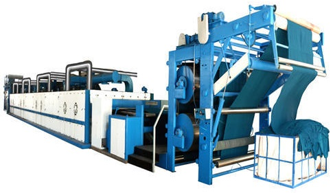
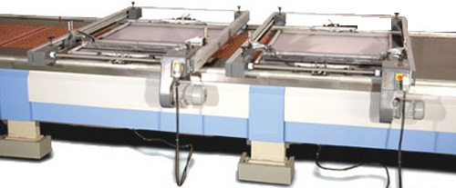
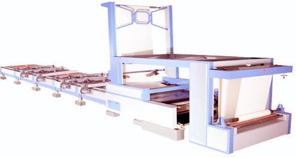

# Automatic Locating System for Flat Bed Silk Screen Printing Pipeline

黄冈市与武汉大学2019年百校千企签约项目

For Chinese version please go to [切换到中文版](readme_cn.md)

[^_^]:
https://github.com/yabeeTech/auto-locator

[^_^]:
https://gitee.com/yabeeTech/auto-locator

[^_^]:
file://F:/Projects/yabee/git/auto-locator/

[^_^]:
https://www.wikihow.com/Make-Silk-Screen-Stencils

[^_^]:
https://systauto.com/

[^_^]:
https://www.mrprint.com/

[^_^]:
https://once-tech.com/

[^_^]:
https://www.textileprintingmachines.net/

[^_^]:
https://www.midwestsign.com/

[^_^]:
https://www.midwestsign.com/blog/2020/09/09/is-an-automatic-screen-coating-machine-right-for-you/

[^_^]:
https://www.screenprinting.com/

[^_^]:
https://www.screenprinting.com/blogs/news/stark-screen-printings-recipe-for-success-hard-work-quality-product-best-customer-service

[^_^]:
https://www.ebay.com/b/Commercial-Screen-Printing-Equipment/46736/bn_16565834

[^_^]:
https://www.wikihow.com/Use-a-Yudu-Screen-Printing-Machine

************************************

Flat screen printing machine also called flat-bed / flat bed screen printing machine, 
it is a traditional screen printing process print on the flat surface substrate.
Yabee Tech devote to manufacture and supply impeccable quality Fully Automatic Flat-bed
Screen Printing System. Our products are available in numerous specifications as per the 
variegated requirements of our customer.

This is a repository of supplying resource for the development of Stencil Frame
Automatic Locating System for Automatic Flat Bed Screen Printing Pipeline Machine 
(**Automatic Screen Frame Micro Adjusting System**), 
supported by Yabee tech Co.

Maintaining by: Dr. Jicheng Hu

**Current maintaining status:** 
The capture delays a lot(more than 1s), this is more likely to be multiple copying 
procedures in the memory pool. Consider to use directly the memory provided by HK.
Please go to [Maintaining Status](maintaining.md) for detail description.

## 1 Overview of the System

The system contains the following modules:
* auto-testing tools
* device end
* control center
* data center

* antistatic conveyor belt ([Siegling belts](https://www.forbo.com/movement/en-gl/industries-applications/textile-industry/pftlf8))
* speed up area
* slow down area
* constant speed area
* human body infrared induction
* double air cooling system
* bipolar driven technology

* fabric float dryer

* Automatic loaders and unloaders
* Automatic ink dispenser
* Pre-treatment station
* Screen frame micro adjust

The utterly simple and modular design allows service and maintenance with basic tools. 
Approached by industry AI, computers and dedicated control boards form the most rugged 
machine and reliable control system the modern world has to offer.
You’ll be amazed at how we took the complexity out and put the productivity in. 
The machine was designed for none-labor to operate.

## 2 Control Center

The control center consists of a series of industrial computers, each of which controls a 
actuator of locating the corresponding stencil frame.

The final implementing mechanism of the system uses displacement control. Early on, 
we used CAN bus servo motors for displacement control, and in the future we considered 
industrial Ethernet to achieve the control of the actuator.

Based on cost considerations, we currently use servo motors in conjunction with cylinder 
clamping for displacement control, and in the future we may consider using electro-hydraulic 
servos to replace cylinders.

### 2.1 The Software Architecture of Control Center

The architecture of the software emphasizes reusability, which means that it is easy to port to 
the control process of new machines and equipment in the future. Abstract the components that 
make up the machine, combine the objects of CDevice into hierarchical CDevice objects, and use 
template classes and template functions to improve the reusability of the code. All controllable 
executing actuators are encapsulated as CDevice subclasses, such as CMotor and CValve, which are 
both subclasses of CDevice.

The actions of an executing actuator are managed according to its corresponding timeline.

### 2.2 Physical layer and logical layer of the control system

The **physical layer** formed by the hardware device includes the basic CAN network, the control 
circuit board, the execution mechanism and so on.

The **logical layer** formed by control logic is an abstraction of control actions, 
isolated from the physical layer.

The following is an example of how to draw abstractions of physical and logical layers by 
analyzing the actions of the two corner cylinders to perform push propulsion in concert.

The two corner cylinders form a push mechanism, CDevicePush, whose Action includes push and reset. 
This requires the establishment of a synchronization clock to synchronize the actions of the two 
sub-devices through the timestamp. On the hardware, the two corner cylinders can be driven by 
different circuit boards, but logically they appear to be driven simultaneously. Therefore, 
the whole system must establish a synchronous clock system, so that each circuit board synchronize 
its actions on time through the timestamp.

Synchronization is done by hardware devices, so you also need to abstract out the control board 
to keep the timestamps consistent. As for how the timestamp of the servo motor is set, it is 
necessary to read the control protocol of the servo motor in detail to form a global 
synchronization network. You can also consider abstracting the servo motor controller into a 
control board that follows the same logic synchronization.

### 2.3 Camera Configuration

### 2.4 Class CMgrChannel

The thread handle `HANDLE m_hThreadCapture` is associated with the thread loop 
`void loopCapture ( )` when the capture thread is created in 
`void CMgrChannel::onCapture ( )`.

### 2.5 Class CthreadNetworkService

