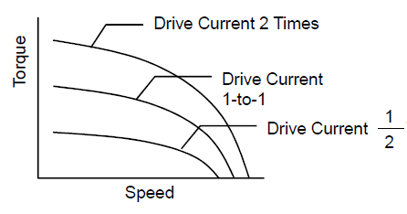

# Bipolar Driven

[^_^]:
https://blog.orientalmotor.com/wiring-basics-unipolar-vs-bipolar

*****************************

## 1 Wiring Basics: Unipolar vs Bipolar

An easy way to alter the speed and torque characteristics of a stepper motor is to 
connect it to a different type of driver or change its wiring configuration.  
However, there's more to it.  Knowing the pros and cons between "unipolar" and "bipolar" 
can make or break your stepper motor performance.

Let's look at these two different speed-torque curves.  These curves are actually generated 
from the same "base" motor but with different drivers.  Notice how speed and torque 
characteristics change.  HINT: pick a certain speed, then compare the torque at that speed.

A speed torque curve displays a stepper motor's performance characteristics with a given set 
of voltage, current, and type of driver, and it's used to determine if a motor will meet the 
torque and speed requirements for an application.  The shape of the speed torque curve is 
affected by the motor's electrical characteristics, such as current or inductance.

### 1.1 REVIEW: How is torque generated?

First, let's start at the beginning and review how torque of a stepper motor is generated. 
We know that torque is proportional to the product of the driving current and the number of 
winding turns (coil).  With greater number of turns, torque is higher but high speed torque 
is sacrificed, thereby limiting the maximum speed that the stepper motor can run effectively. 
With lower number of turns, torque is decreased at lower speeds, but it is maintained out to 
faster speeds.

Let's take a look at the torque formula.

Here's how current affects the speed torque curve of a stepper motor.

Here's how number of turns of winding affects the speed torque curve of a stepper motor.

### 1.2 But...what if you can't change the winding current or number of turns?  

N (number of turns of winding) and I (current) are typically specified and cannot be changed, so what else can you do to change the speed torque curve?  If you have at least 6 wires from your stepper motor, the answer is look into "unipolar" and "bipolar" wiring configurations.

 
#### 1.2.1 What does "unipolar" and "bipolar" mean?

Now, let's take a look at the words, "unipolar" and "bipolar".  
What do these words mean exactly? 

The terms, "unipolar" and "bipolar", originated from the type of drivers used to drive 
stepper motors.  In simpler terms, the "uni" in unipolar means "one" and the "bi" in 
bipolar means "two".  The "polar" means electrical and magnetic polarity (FYI: the direction 
of the current flow determines polarity). 

The main difference between "unipolar" and "bipolar" stepper motors is the center tap wire, 
which splits the full coils of the winding in half.  This could be done with one wire or 
two wires.  If you remove the center tap, then it becomes a bipolar-series connection.

The main difference between "unipolar" drivers and "bipolar" drivers is its ability to 
send current.  The driver's ability to send current in one direction or both directions 
is directly correlated to the number of transistors used by the driver.  A bipolar driver 
would require double the number of transistors than a unipolar driver in order to control 
the current flow in both directions.

