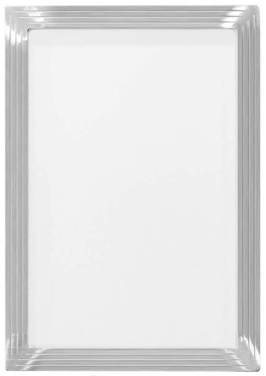
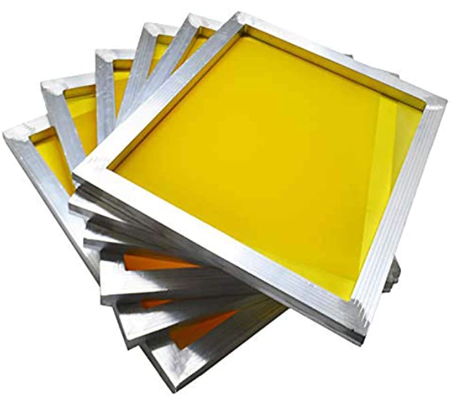
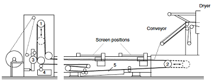

# Flat Bed Screen Printing

https://textilehelp.org/automatic-flat-bed-screen-printing-machine/

****************************

screen frame

screen frames

## 1 AUTOMATIC FLAT-BED SCREEN PRINTING MACHINE

An automatic Flat-bed Screen printing Machine is an improvement over the hand screen 
printing process-an improvement effected by mechanisation.

## 1.1 INTRODUCTION
The machine consists of a printing table (flat bed), an endless conveyor belt to bring the 
fabric on to the table under the screens periodically, a number of screens, a special 
mechanism for lowering the screen on the required parts of the fabric squeegees driven by motor.

A special conveyor under the table to collect extra paste, an arrangement for gumming the 
fabric to the conveyor belt and a drier.

 Automatic Flat Bed Screen Printing Machine

