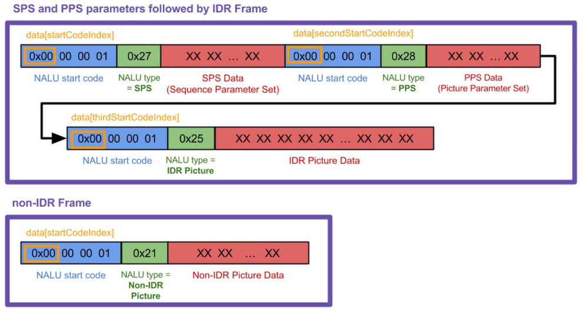
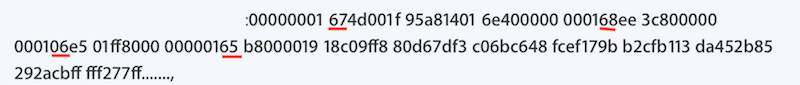

# How h.264 elementary stream parsing into nalu

The elementary stream in h.264 should be like this:

So the key is to generate individual NALUs from H.264 stream. 
So we should get the bitstream like this:

## refs

[Possible Locations for Sequence/Picture Parameter Set(s) for H.264 Stream](https://stackoverflow.com/questions/24884827/possible-locations-for-sequence-picture-parameter-sets-for-h-264-stream)

<https://stackoverflow.com/questions/37450642/how-h-264-elementary-stream-parsing-into-nalu>

[H264中的NALU概念解析](https://blog.csdn.net/pkx1993/article/details/79974858)

[I帧、B帧、P帧、NALU类型](https://www.cnblogs.com/ljtknowns/p/9281838.html)

[NALU的解释](https://blog.csdn.net/weixin_40673765/article/details/100038354)

