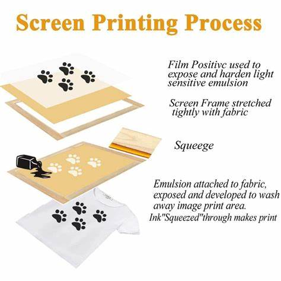

# How to Make a Stencil for Silk Screen Printing

[^_^]:
[How to Make a Stencil for Silk Screen Printing](https://www.myboxprinting.com/blog/how-to-make-a-stencil-for-silk-screen-printing/)

***************************

Normally printing experts suggest printing desired designs in black ink on photographic 
paper and using photographic or light-sensitive emulsion, but it is not the only way for 
making a stencil for silk screen printing. Here is how to make a stencil for silk screen 
printing with the help of an emulsion technique that is considered superior to others.

## What is Emulsion Technique?

