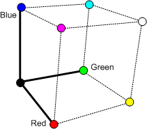

# About YUV Video

<https://docs.microsoft.com/en-us/windows/win32/medfound/about-yuv-video>

[Microsoft MPEG-2 Video Encoder](https://docs.microsoft.com/en-us/windows/win32/directshow/microsoft-mpeg-2-video-encoder)

******************************************

The three RGB values form a mathematical coordinate system, called a color space. The 
red component defines one axis of this coordinate system, blue defines the second, and 
green defines the third, as shown in the following illustration. Any valid RGB color falls 
somewhere within this color space. For example, pure magenta is 100% blue, 100% red, 
and 0% green.

Although RGB is a common way to represent colors, other coordinate systems are possible. 
The term YUV refers to a family of color spaces, all of which encode brightness information 
separately from color information. Like RGB, YUV uses three values to represent any color. 
These values are termed Y', U, and V. (In fact, this use of the term "YUV" is technically 
inaccurate. In computer video, the term YUV almost always refers to one particular color 
space named Y'CbCr, discussed later. However, YUV is often used as a general term for any 
color space that works along the same principles as Y'CbCr.)

The Y' component, also called luma, represents the brightness value of the color. The prime 
symbol (') is used to differentiate luma from a closely related value, luminance, which is 
designated Y. Luminance is derived from linear RGB values, whereas luma is derived from 
non-linear (gamma-corrected) RGB values. Luminance is a closer measure of true brightness 
but luma is more practical to use for technical reasons. The prime symbol is frequently 
omitted, but YUV color spaces always use luma, not luminance.

Luma is derived from an RGB color by taking a weighted average of the red, green, and blue 
components. For standard-definition television, the following formula is used:

$$
Y' = 0.299R + 0.587G + 0.114B
$$

This formula reflects the fact that the human eye is more sensitive to certain wavelengths 
of light than others, which affects the perceived brightness of a color. Blue light appears 
dimmest, green appears brightest, and red is somewhere in between. This formula also reflects 
the physical characteristics of the phosphors used in early televisions. A newer formula, 
taking into account modern television technology, is used for high-definition television:

$$
Y' = 0.2125R + 0.7154G + 0.0721B
$$

The luma equation for standard-definition television is defined in a specification named 
ITU-R BT.601. For high-definition television, the relevant specification is ITU-R BT.709.

The U and V components, also called chroma values or color difference values, are derived 
by subtracting the Y value from the red and blue components of the original RGB color:
$$
U = B - Y'
$$
$$
V = R - Y'
$$

Together, these values contain enough information to recover the original RGB value.

## 1 Benefits of YUV

Analog television uses YUV partly for historical reasons. Analog color television signals 
were designed to be backward compatible with black-and-white televisions. The color television 
signal carries the chroma information (U and V) superimposed onto the luma signal. 
Black-and-white televisions ignore the chroma and display the combined signal as a 
grayscale image. (The signal is designed so that the chroma does not significantly interfere 
with the luma signal.) Color televisions can extract the chroma and convert the signal back 
to RGB.

YUV has another advantage that is more relevant today. The human eye is less sensitive to 
changes in hue than changes in brightness. As a result, an image can have less chroma 
information than luma information without sacrificing the perceived quality of the image. 
For example, it is common to sample the chroma values at half the horizontal resolution of 
the luma samples. In other words, for every two luma samples in a row of pixels, there is one 
U sample and one V sample. Assuming that 8 bits are used to encode each value, a total of 4 
bytes are needed for every two pixels (two Y', one U, and one V), for an average of 16 bits 
per pixel, or 30% less than the equivalent 24-bit RGB encoding.

YUV is not inherently any more compact than RGB. Unless the chroma is downsampled, a YUV 
pixel is the same size as an RGB pixel. Also, the conversion from RGB to YUV is not lossy. 
If there is no downsampling, a YUV pixel can be converted back to RGB with no loss of 
information. Downsampling makes a YUV image smaller and also loses some of the color 
information. If performed correctly, however, the loss is not perceptually significant.

## 2 YUV in Computer Video

The formulas listed previously for YUV are not the exact conversions used in digital video. 
Digital video generally uses a form of YUV called Y'CbCr. Essentially, Y'CbCr works by 
scaling the YUV components to the following ranges:

| Component	| Range |
| :-- | :-- |
| Y' | 16C235 |
| Cb/Cr | 16C240, with 128 representing zero |
 

These ranges assume 8 bits of precision for the Y'CbCr components. Here is the exact 
derivation of Y'CbCr, using the BT.601 definition of luma:

1. Start with RGB values in the range [0...1]. In other words, pure black is 0 and pure 
white is 1. Importantly, these are non-linear (gamma corrected) RGB values.

2. Calculate the luma. For BT.601, Y' = 0.299R + 0.587G + 0.114B, as described earlier.

3. Calculate the intermediate chroma difference values (B - Y') and (R - Y'). These values 
have a range of +/- 0.886 for (B - Y'), and +/- 0.701 for (R - Y').

4. Scale the chroma difference values as follows:

Pb = (0.5 / (1 - 0.114)) × (B - Y')

Pr = (0.5 / (1 - 0.299)) × (R - Y')

These scaling factors are designed to give both values the same numerical range, +/- 0.5. 
Together, they define a YUV color space named Y'PbPr. This color space is used in analog 
component video.

5. Scale the Y'PbPr values to get the final Y'CbCr values:

Y' = 16 + 219 × Y'

Cb = 128 + 224 × Pb

Cr = 128 + 224 × Pr

These last scaling factors produce the range of values listed in the previous table. 
Of course, you can convert RGB directly to Y'CbCr without storing the intermediate results. 
The steps are listed separately here to show how Y'CbCr derives from the original YUV 
equations given at the beginning of this article.

The following table shows RGB and YCbCr values for various colors, again using the BT.601 
definition of luma.

| Color | R | G | B | Y' | Cb | Cr |
| :- | :- | :- | :- | :- | :- | :- |
| Black | 0 | 0 | 0 | 16 | 128 | 128 |
| Red | 255 | 0 | 0 | 81 | 90 | 240 |
| Green | 0 | 255 | 0 | 145 | 54 | 34 |
| Blue | 0 | 0 | 255 | 41 | 240 | 110 |
| Cyan | 0 | 255 | 255 | 170 | 166 | 16 |
| Magenta | 255 | 0 | 255 | 106 | 202 | 222 |
| Yellow | 255 | 255 | 0 | 210 | 16 | 146 |
| White | 255 | 255 | 255 | 235 | 128 | 128 |

As this table shows, Cb and Cr do not correspond to intuitive ideas about color. For example, 
pure white and pure black both contain neutral levels of Cb and Cr (128). The highest and 
lowest values for Cb are blue and yellow, respectively. For Cr, the highest and lowest values 
are red and cyan.

### 2.1 YUV 与 RGB 格式差异

YUV 的存储中与 RGB 格式最大不同在于，RGB 格式每个点的数据是连继保存在一起的。即 R，G，B
是前后不间隔的保存在 2-4byte 空间中。而 YUV 的数据中为了节约空间，U，V
分量空间会减小。每一个点的 Y 分量独立保存，但连续几个点的 U，V
分量是保存在一起的，通常人的肉眼察觉不出。

### 2.2 YUV格式分析

YUV 格式分为两种类型：Packed 类型和 Planar 类型。其中，Packed 类型是将 YUV
分量存在在同一个数组中，每个像素点的 Y、U、V 是连续交错存储的；Planar 类型是将 YUV
分量分别存放到三个独立的数组中，且先连续存储所有像素点的 Y，紧接着存储所有像素点的 U，最后是所有像素点的V。

#### 2.2.1 YUV采样格式

YUV 码流的存储格式与采样方式密切相关，目前主流的采样方式有如下三种：YUV444、YUV422、YUV420，其中，YUV444
采样是每一个 Y 对应一组 UV 分量，每个像素 (YUV) 占 32 Bits；YUV422 采样是每两个 Y
共用一组 UV 分量，每个像素占 16bits（Y 占 8bits、UV 分量占 8bits）；YUV420 采样是每四个 Y
共用一组 UV 分量，每个像素 (YUV) 占 16bits 或者 12bits。通常，YUV A:B:C
的意思一般是指基于 4 个象素来讲, 其中 Y 采样了 A 次，U采样了 B 次, V 采样了 C
次。假设以黑点表示采样该像素点的Y分量，以空心圆圈表示采用该像素点的 UV 分量，三种采样格式表示如下图：

a) YUV444：表示 Y、U、V 所占比为 4 : 4 : 4，这种采样方式的色度值 UV 不会较少采样，Y、U、V
分量各占一个字节，连同 Alpha 通道一个字节，YUV444 每个像素占 4 字节，也就是说这个格式实质就是 24bpp
的 RGB 格式。采样示例：

    如果原始数据四个像素是：A0 Y0 U0 V0, A1 Y1 U1 V1, A2 Y2 U2 V2, A3 Y3 U3 V3 \
    经4:4:4采样后数据依然为：A0 Y0 U0 V0, A1 Y1 U1 V1, A2 Y2 U2 V2, A3 Y3 U3 V3

b) YUV422：表示Y、U、V所占比为 4 : 2 : 2，这种采样方式的色度值 UV 分量采样减半，比如第一个像素采样为
Y、U，第二个像素采样 Y、V，依此类推… YUV422 每个像素占 2 个字节。采样示例：

    如果原始数据四个像素是：Y0 U0 V0, Y1 U1 V1, Y2 U2 V2, Y3 U3 V3 \
    经过4:2:2采样后数据变成：Y0 U0, Y1 V1, Y2 U2, Y3 V3

c) YUV420：并不意味没有 V 分量，0 的意思是 U、V 分量隔行才采样一次，比如第一行采样为 4:2:0，第二行采样
4:0:2，依此类推… YUV 采样(每个像素)占用 16bits 或 12bits。总之除了4:4:4 
采样，其余采样后信号重新还原显示后, 会丢失部分 UV 数据，只能用相临的数据补齐，但人眼对 UV
不敏感，因此总体感觉损失不大。

#### 2.2.2 YUV420 采样分析

由于海康实时采集的视频帧格式为 YV12 或者 NV21，它们都属于 YUV420
采样格式，接下来我们对这种格式进行一个简单的分析。YUV420
格式所采样的采样格式为 4：2：0，即 4 个 Y 分量共用一组 UV
分量，它所占内存为 16bits/pixel或12Bits/Pixel(像素)，而我们要研究的 YV12 和 NV21
每个像素的占内存为 12bit，其中每个像素由一组 YUV 构成。该颜色格式对于每个像素 Y、U、V
分别占内存大小为 Y=8bit=1Byte、U=2bit=1/4(Byte)、V=2bit=1/4(Byte)，即一个像素中 Y、U、V
的比例为 4:1:1。假设原始帧图像为 640x480 像素，它所占用的内存空间大小为：

    640*480*(Y+Y/4+Y/4) =640*480*(1+1/4+1/4)*(1 Byte) = 640*480*(3/2)字节=450KB

其中，1个 Y 分量占内存1个字节(Byte)，因此经过计算可知一帧 640x480 像素的 YV12 或 NV21
的图片所占内存大小为 450KB，这也解释了我们在对 Camera 采集的 YV12 或 NV21
格式数据进行编码时，需要开辟一个大小为`[widt*height*3/2]`的字节数组作为缓存的原因。
由于内存存储的最小单位为字节，Y、U、V 分别占用内存空间为 (以 YV12 类型为例)：

    Y 分量：(640*480) 个字节，内存存储范围为 0 ~ 640*480 字节

    V(Cr)分量：(640*480*(1/4)) 个字节，存储范围为 640*480 ~ (1+1/4)*640*480 字节

    U(Cb)分量：(640*480*(1/4)) 个字节，存储范围为 5/4*640*480 ~ 640*480*3/2 字节

#### 2.2.3 I420、YV12、NV12、NV21区别

1) YUV420SP、YUV420P：属于 YUV420 格式。对于所有 YUV420 格式图像，它们的 Y
值排列完全相同，因为只有 Y 的图像是灰度图像。YUV420P 中 Y，U，V
三个分量都是平面格式，分为 I420(标准YUV420，YYYYYYYYUU VV) 和 YV12 两种；YUV420SP
中 Y 分量为平面格式，UV 打包格式，分为 NV12 与 NV21 两种。需要注意的是，YUV
格式的存放方式永远是先排列完Y分量，再排序 U 或 V 分量，不同的采样只是 U 或 V 分量的排列格式和顺序不同。

2) YV12、I420：属于 YUV420P 格式，每一个像素点的 YUV 数据提取遵循 YUV420
格式的提取方式，即 4个 Y 分量共用一组 UV。它是一种 Plane 模式，将 Y、U、V
分量分独立的三个 plane 依次存储，如下图所示。I420、YV12 的 Y 值排序完全相同，只是 U、V
平面的位置不同，存储空间结构如下：

YV12 ：亮度（行×列）＋ V（行×列/4) + U（行×列/4）

I420 ：亮度（行×列）＋ U（行×列/4) + V（行×列/4）

举例：Y0Y1Y2Y3 U0 V0(I420)、Y0Y1Y2Y3V0U0(YV12)。

总结：

I420:YYYYYYYY  UU VV    =>YUV420P(Plane模式)

YV12:YYYYYYYY  VV UU    =>YUV420P(Plane模式)

NV12:YYYYYYYY  UVUV     =>YUV420SP(2个Plannar，Y为平面模式，UV为打包模式)

NV21:YYYYYYYY  VUVU     =>YUV420SP(2个Plannar，Y为平面模式，UV为打包模式)

